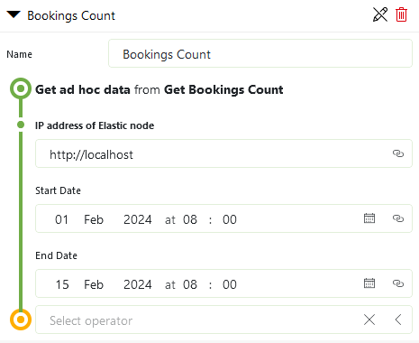
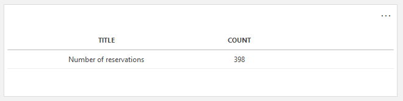

# SLC-GQIDS-Bookings

This repository contains the **Get Bookings Count** Ad Hoc Data Source that queries an ElasticSearch database and returns the total number of bookings during a specified time interval.

The bookings count is retrieved directly from the ElasticSearch database: this yields better performance than other methods (*e.g.*: using the built-in **Get Bookings** query and using the **Count** operator)

The following parameters are required by the script:
 - **IP address of Elastic node**: the IP address of the ElasticSearch node the user wants to access.
 - **Start Date**: bookings that ended before this date won't be counted.
 - **End Date**: bookings that started after this date won't be counted.

**Start Date** and **End Date** are optional: if they are not filled they will be ignored.

## Usage

1. Import the script as an automation script in your DataMiner Cube environment.
2. In your Dashboard Queries, select **Get ad hoc data** and specify the source **Get Bookings Count**.
3. Provide the required input parameters.
4. Visualize the retrieved data on your dashboard. 

### Demonstration 

